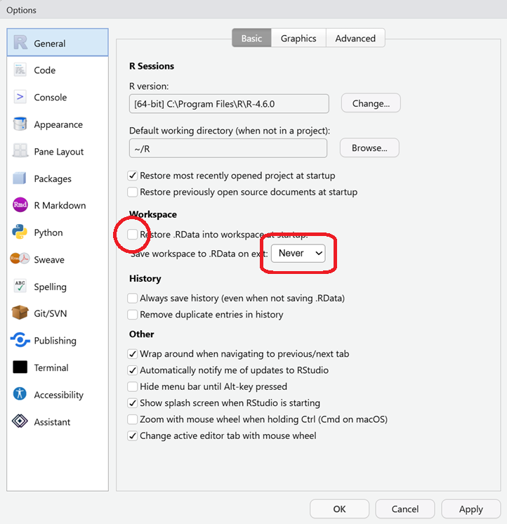

## R과 RStudio 시작하기

- 설치 및 링크
  - [R 다운로드 및 설치](https://cloud.r-project.org/){target="_blank"}
  - [RStudio 다운로드 및 설치](https://posit.co/download/rstudio-desktop/){target="_blank"}

- RStudio Option 변경
  - Restore .RData into workspace at startup: 체크 해제
  - Save workspace to .RData on exit: Never 선택

{width=60%}

- RStudio 화면의 구성
  - 4개의 Panes: Source, Console, Environment, Files
  - 여러 개의 Tabs

## 작업 방식

- R 스크립트를 작성하여 실행
  - R 스크립트: R 명령들을 순서대로 저장해 둔 텍스트 파일
  - 파일 확장자는 .R
  - 수업에 사용한 R 스크립트는 반드시 저장해서 보관
- `Ctrl + Enter`를 이용하여 스크립트의 줄 단위로 실행 (맥OS에서는 `Command + Return`)
  - 다른 실행 방식은 이후 시간에 소개
- `#`를 이용하여 주석달기
  - `#`로 시작하는 줄은 실행되지 않으므로 코드의 목적 설명, 자신을 위한 메모에 사용
- 디렉토리 관리를 위해 RStudio Project 활용
  - 이후 시간에 소개
- 기타 사소한 사항들
  - RStudio 자동완성기능: 괄호, 따옴표, 함수 및 변수 이름 등
  - 코드 정렬 단축키: `Ctrl + I`
  - R 다시 시작하기 단축기: `Ctrl + Shift + F10`


## R 스크립트 예제

**R 스크립트 예제의 진행 순서**

1. 환경준비
    - 패키지란: 특정 기능을 수행하는 함수, 데이터, 문서를 묶어놓은 배포 단위
    - 패키지 설치: `install.packages("skimr")` (설치는 한번만, 스크립트에는 넣지 않음)
    - 패키지 불러오기: `library(skimr)`
2. 데이터 불러오기
    - 패키지에 포함된 데이터 불러오기
    - 외부파일 직접 불러오기
    - 패키지를 이용하여 인터넷에서 데이터 불러오기
3. 데이터의 기본적 특성 파악하기
    - 변수의 수, 관측치의 수
    - 수치형 (numerical) 변수와 범주형 (categorical) 변수
    - 결측치 (missing values) 및 이상치 (outliers)
4. 데이터 변형하기
    - 필요한 변수만 선택
    - 새로운 변수 생성
    - 조건에 맞는 관측치 선택
    - 관측치 정렬
5. 시각화 및 표 작성하기
    - 히스토그램, 상자그림 (boxplot)
    - 산점도 (scatter plot)
    - 도수분포표, 교차표
6. 모형 추정
    - 선형회귀모형
7. 결과 저장


```r
# ============================================================
# [Practice in Data Analysis] 1주차 스크립트 예제1
# 학번: **********
# 이름: XXX
# 날짜: 2026-XX-XX
# ============================================================


# ============================================================
# 1. 환경 준비 ---------------------------------------------------
# ============================================================
# 한번만 설치하고 그 이후로는 지웁니다.
# install.packages("tidyverse")
# install.packages("janitor")
# install.packages("skimr")

# 아래 세 패키지는 이 수업의 모든 연습에 항상 사용합니다. 
library(tidyverse)
library(janitor)
library(skimr)

# 이번 연습에 사용할 패키지입니다. 설치는 한번만.
# install.packages("gapminder")  # 패키지 설치
library(gapminder)             # 패키지 불러오기

# ============================================================
# 2. 데이터 불러오기 ---------------------------------------------
# ============================================================
# gapminder는 패키지에 포함되어 배포되므로 따로 데이터를 부를 필요가 없습니다.
# 외부 데이터를 불러오는 방법은 이후 시간에 다룹니다.
# 예를 들어 read_csv("data/example.csv)


# ============================================================
# 3. 데이터의 기본적 특성 파악 -------------------------------------
# ============================================================
# skim의 결과를 잘 이해할 수 있도록 반복해서 공부하세요.
# 많은 경우 View를 이용하여 실제 데이터의 모습을 보는 것도 도움이 됩니다.
?gapminder
skim(gapminder)
View(gapminder)


# ============================================================
# 4. 데이터 변형 --------------------------------------------------
# ============================================================
# 표본 중 일부를 선택하거나, 새로운 변수를 만들기 
df2007 <- gapminder |>
  filter(year == 2007) |>
  mutate(
    log_gdp     = log(gdpPercap),
    pop_million = pop / 1e6
  )

skim(df2007)

# ============================================================
# 5. 시각화 및 표 작성 ---------------------------------------------
# ============================================================

# 도수분포표: skim으로 이미 확인했지만 더 깔끔하게
df2007 |> tabyl(continent) |> 
  adorn_pct_formatting(digits = 1)


# 산점도: 1인당 GDP와 기대수명의 관계
p1 <- ggplot(df2007, aes(x = gdpPercap, y = lifeExp)) +
  geom_point() +
  labs(
    title = "1인당 GDP와 기대수명 (2007)",
    x = "1인당 GDP",
    y = "기대수명 (년)"
  ) 

p1

# 그룹별 요약:
df2007 |> 
  select(lifeExp, continent) |> 
  group_by(continent) |> 
  skim()


# 시계열: 한국과 일본의 기대수명 추이
p2 <- gapminder |> 
  filter(country == "Korea, Rep." | country == "Japan") |> 
  ggplot(aes(x = year, y = lifeExp, color = country)) +
  geom_line() +
  labs(
    title = "한국과 일본의 기대수명 추이",
    x = "연도",
    y = "기대수명 (년)"
  ) 

p2


# ============================================================
# 6. 모형 추정 ----------------------------------------------------
# ============================================================
# 회귀분석: 1인당 GDP로 기대수명을 설명하는 회귀모형을 추정 
fit <- lm(lifeExp ~ log_gdp, data = df2007)
summary(fit)


# ============================================================
# 7. 결과 저장 (보고서에서 불러 쓸 것들) ----------------------------
# ============================================================
# figure1.png가 생성되었는지 확인해 보세요

ggsave("figure1.png", plot = p1, width = 7, height = 5)
ggsave("figure2.png", plot = p2, width = 7, height = 5)

```

## 실습


**실습 1**

::: {.callout-important title="실습 1: 주의사항"}

- 위의 R 스크립트를 복사하여 RStudio source에 옮긴 후 week01_ex1_학번.R로 저장합니다. (예를 들어, 학번이 2014035면 week01_ex1_2014035.R로 저장)

    - 스크립트 상단에 제목, 작성자, 날짜를 적습니다.
    - 먼저 필요한 패키지를 설치합니다: `tidyverse`, `janitor`, `skimr`, `gapminder`

- R 스크립트의 명령을 `Ctrl + Enter`를 이용하여 한 줄씩 실행하고 결과를 확인합니다.

    - 여러 줄에 걸친 명령은 실행하기 전에 먼저 어디까지가 한 줄인지 파악합니다.
    - 에러가 발생하면 에러 메시지를 읽고 의미를 확인합니다.

- 아래 실습의 문제와 답은 별도의 Microsoft Word 문서를 만들어 기록합니다. 문서 이름은 week01_ex1_학번.docx로 저장합니다. 
(예를 들어, 학번이 2014035면 week01_ex1_2014035.docx로 저장)

- 실습이 끝난 후 week01_ex1_학번.R과 week01_ex1_학번.docx를 E-class 과제로 제출하세요.

:::


1. `3. 데이터의 기본적 특성 파악` 부분을 실행하면서 답하세요.

    (1) `gapminder` 데이터의 변수는 몇 개입니까? 관측치는 몇 개입니까?
    (2) 각 변수의 의미를 설명하고, 각각이 수치형(numerical)인지 범주형(categorical)인지 설명하세요.
    (3) 출생 시 기대수명 (`lifeExp`)의 평균은? 최대값, 최소값, 중간값은?

2. `4. 데이터 변형` 부분을 실행하면서 답하세요. 처음 여섯 줄은 하나의 명령입니다. 

    (1) 아래와 같이 코드를 수정하고 실행한 다음 결과를 비교하고 무엇이 달라졌는지 설명하세요.

      - `df2007` → `df1952`
      - `filter(year == 2007)` → `filter(year == 1952)`
      - `skim(df2007)`→`skim(df1952)`
    
    (2) 1의 답에 비추어 `filter(year == 2007)`의 의미를 짐작해 보세요.
    (3) `df2007` 또는 `df1952`의 변수는 모두 몇 개입니까?
    (4) 3의 답에 비추어 `mutate( ... )`의 의미를 짐작해 보세요.
    (5) `|>`의 의미를 짐작해 보세요.

3. `5. 시각화 및 표 작성` 부분을 실행하면서 답하세요.

    (1) `df2007` 데이터에서 대륙별 비중을 설명하세요. 

    (2) 1인당 GDP와 기대수명의 관계를 말로 설명하세요. 산점도를 그리기 이전에 가졌던 기대와 다른 부분이 있다면 언급하세요.

    (3) 인구 (`pop`)와 기대수명의 관계를 나타내는 산점도를 그려보고 특징을 설명하세요.

4. `7. 결과 저장` 부분을 실행하면서 답하세요.

    (1) `figure1.png`과 `figure2.png`가 생성되었는지 확인하고 Word 문서에 삽입해 보세요. 

    (2) `ggsave()`의 `width`와 `height`의 값을 바꾸어 보고 생성된 파일의 변화를 확인하세요. 
    `width`와 `height`의 단위가 무엇인지 짐작해 보세요.
  