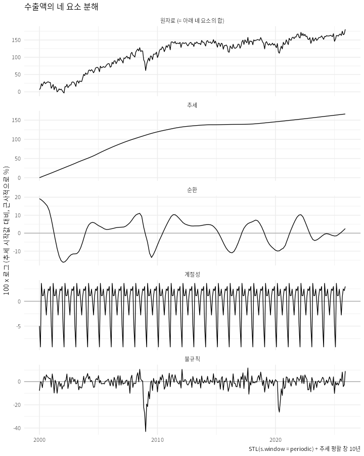

## Base R: 벡터와 데이터 프레임 

### 왜 base R?

- 인터넷 예제 코드, 도움말, 패키지 문서에 base R 문법이 섞여 있어서 읽을 줄 알아야 함
- 에러 메시지와 모델 객체(모형을 실행한 결과를 저장한 것)도 base R의 용어와 구조를 따름

### 벡터

- 벡터: 같은 종류의 값을 한 줄로 늘어 놓은 것
  - `c()`로 벡터를 생성
  - 데이터 프레임의 한 열이 벡터
  - 자료형: numeric, character, logical, factor
  - 자료형은 `class()`로 확인

```{r}
#| eval: false
#| echo: true
#| code-fold: true
#| code-summary: "R 스크립트 코드 보기/접기"


x <- c(10, 2, 6, 1, 5)
y <- c("apple", "banana", "cranberry", "durian")
z <- c(TRUE, FALSE, TRUE, TRUE)
w <- as.factor(y)

class(x)
class(y)
class(z)
class(w)

length(x)
length(y)
```

- `[]`의 용법
  - 양의 정수: 해당 위치의 원소 선택
  - 음의 정수: 해당 위치의 원소 제외
  - 논리벡터: TRUE인 위치만 선택 (조건 서브셋 `x[x > 5]`)
  - 이름: 이름이 붙은 원소 선택
  - 함께 쓰는 도구: `which()`, `%in%`

```{r}
#| eval: false
#| echo: true
#| code-fold: true
#| code-summary: "R 스크립트 코드 보기/접기"
#| collpase: true

y[2]
y[c(2, 4)]
y[-3]
y[z]
x[x < 3]
which(y == "banana")
"fig" %in% y
```


### 데이터 프레임

- 데이터 프레임은 R에서 표 형태의 데이터를 다루는 기본 방식
  - 열 (세로줄)은 변수, 행 (가로줄)은 관측치 (observation)

- 데이터 프레임에서 변수를 꺼내기
  - `$` 이용: `데이터프레임$변수이름`
  - 추출된 열은 벡터
  - `df[행, 열]`은 벡터 인덱싱을 두 축으로 확장 

- tibble은 tidyverse에서 변형된 data frame
  - 콘솔에 출력할 때 모양이 약간 다를 수 있으나 대부분의 경우 둘 사이의 차이는 미미함

- tidyverse와 base R 대응표

| 하려는 일 | tidyverse | base R |
|:-------------|:-----------------------------------|:------------------------------------|
| 한 열 꺼내기 | `pull(lifeExp)` | `df$lifeExp` |
| 새 변수 | `mutate(gdp = gdpPercap * pop)` | `df$gdp <- df$gdpPercap * df$pop` |
| 행 선택 | `filter(year == 2007)` | `df[df$year == 2007, ]` |
| 열 선택 | `select(country, lifeExp)` | `df[, c("country", "lifeExp")]` |


### 퀴즈

1. `x <- c(15, 18, 3, 10)`일 때 `x[x > 10]`의 결과를 예측하세요.

2. 다음 코드의 결과를 예측하세요.

```r
library(gapminder)
class(gapminder$country)
```

3. 다음 tidyverse 코드를 base R로 바꾸세요.

```r
gapminder |>
  filter(country == "Korea, Rep.", year >= 2000) |>
  select(year, lifeExp)
```


## 시계열 자료의 기술 (Description)

### 자료 불러오기와 날짜 다루기

- 여기서는 [한국은행경제통계시스템](https://ecos.bok.or.kr/){target="_blank"}에서 월별 수출액 통계를 다운받아서 분석함
  - 통계검색 > 3. 환율/통관수출입/외환보유액 > 3.2. 통관기준 수출입 > 3.2.1. 수출입 총괄 > 수출금액
  - 2000년 1월부터 2025년 12월까지 수출금액을 사용
  - 빈도: 월, 단위: 천불

  [📥 월별 수출액 데이터 다운로드](data/수출입 총괄_03074745.csv){.btn .btn-outline-primary .btn-sm download=""}

- 시계열 자료는 횡단면 자료와 달리 관측 순서가 의미를 가짐

- 날짜는 보통 문자 (character)로 저장되고 표시 형식이 다양하므로 이를 시간 순서로 배치하고 간격을 쉽게 계산하기 위하여 Date 클래스로 변환하는 것이 유리함

  -  `tidyverse`의 일부인 `lubridate` 패키지는 날짜를 다루는 편리한 함수들을 제공

  | 구분 | 대표 함수 | 역할 / 특징 | 입력 예시 (Input) | 출력 결과 (Output) |
  | :--- | :--- | :--- | :--- | :--- |
  | 날짜 파싱<br>(Parsing) | `ym()` | 연-월 순서의 문자열을 Date 객체로 변환 (1일로 자동 지정) | `ym("2026-10")` | `"2026-10-01"` |
  | | `mdy()` | 월-일-연 순서의 문자열을 Date 객체로 변환 | `mdy("Oct 3, 2026")` | `"2026-10-03"` |
  | | `dmy()` | 일-월-연 순서의 문자열을 Date 객체로 변환 | `dmy("03/10/2026")` | `"2026-10-03"` |
  | 요소 추출<br>(Extraction) | `year()` | Date 객체에서 연도 추출 | `year(ymd("2026-10-03"))` | `2026` |
  | | `quarter()` | Date 객체에서 분기 추출 | `quarter(ymd("2026-10-03"))` | `4` |
  | | `month()` | Date 객체에서 월 추출 | `month(ymd("2026-10-03"))` | `10` |
  | | `day()` | Date 객체에서 일 추출 | `day(ymd("2026-10-03"))` | `3` |

- `df$date`의 내용과 클래스가 `ym()`을 적용하기 이전과 이후 어떻게 달라지는지 확인


```{r}
library(tidyverse)
library(skimr)
library(janitor)
df <- read_csv("data/수출입 총괄_03074745.csv",
               skip = 1,
               col_names = c("date", "export"))

df <- df |> 
  mutate(date = ym(date)) |> 
  arrange(date)
```

### 시계열 그래프

- 월별 수출액 (수준)

```{r}
df |>
ggplot(aes(x = date, y = export)) +
  geom_line() +
  labs(title = "월별 수출액 (2000년 1월 ~ 2025년 12월)", x = NULL, y = "수출액 (천불)")
```

- 시계열의 종류에 따라 상이한 패턴이 나타남

  - 장기적으로 상승하는 추세가 뚜렷한 수출액과 달리 아래 국고채 3년 만기 금리는 과거보다 낮아지는 경향 위에 국면별로 오르내려 단일한 추세로 요약되지 않음

  - 수출액은 계절성과 조업일수 등의 차이로 월간 변동이 크지만 금리는 상대적으로 월간 변동이 작고 서서히 움직임

```{r}
#| echo: false
#| 
df2 <- read_csv("data/시장금리(월,분기,년)_03075635.csv",
               skip = 1,
               col_names = c("date", "ktb3y"))

df2 <- df2 |> 
  mutate(date = ym(date)) |> 
  arrange(date)

df2 |>
ggplot(aes(x = date, y = ktb3y)) +
  geom_line() +
  labs(title = "국고채 3년 금리 (월평균, 2000년 1월 ~ 2025년 12월)", x = NULL, y = "연 %")
```


### 시계열의 요소

- 추세: 수년에 걸쳐 완만하게 오르거나 내리는 장기적인 방향

- 순환: 수 년 단위로 오르내리지만 주기의 길이와 폭이 일정하지 않은 변동 (예: 경기순환)

- 계절성: 매년 같은 시기에 비슷한 방향과 크기로 반복되는 규칙적인 변동

- 불규칙 변동: 위 세 가지로 설명되지 않는, 예측하기 어려운 나머지 단기 변동

분해의 예

  {width=70%}


### 변환: 증가율, 로그, 로그차분

- 핵심적 아이디어

  - 뚜렷한 추세가 있는 시계열은 수준보다 증가율을 분석하는 것이 더 유용할 수 있음 (요약통계, 구간 비교, 단기 변동 파악 등)

  - 수준이 커질수록 변동 폭도 비례하여 커지면, 로그를 취하는 것이 유리함 (변동 폭이 수준과 무관하게 비슷해짐)
  
  - 변화가 작을 때, 로그차분은 증가율을 근사함

- 시차: `lag(x)`는 한 기간 전 값, `lag(x, 12)`는 12 기간 전 값

  - `export_l1`과 `export_l12`에 왜 `NA`가 나타나는지 생각해 볼 것

```{r}
df <- df |>
  mutate(export_l1  = lag(export),        # 1개월 전 값
         export_l12 = lag(export, 12))    # 12개월 전 값

head(df, 14)    
```

- 증가율: $(x_{t} /x_{t-1} -1) \times 100$

```{r}
df <- df |>
  mutate(gr_exp = (export / lag(export)     - 1) * 100) 

df |>
  ggplot(aes(x = date, y = gr_exp)) +
    geom_line() +
    labs(title = "월별 수출액 증가율", x = NULL, y = "증가율(%)")
```

- 로그와 로그차분

  - 증가율이 작을 때 로그차분은 증가율과 거의 비슷함

  - 로그차분은 계산과 모형 분석을 편리하게 하는 장점이 있어 자주 사용됨

```{r}
df <- df |>
  mutate(log_export = log(export),
         dlog      = (log_export - lag(log_export)) * 100)

df |>
  ggplot(aes(x = date, y = dlog)) +
    geom_line() +
    labs(title = "월별 수출액 로그차분", x = NULL, y = "로그변화율(%)")
```


### 요약통계와 구간 비교

- 편의상 전체 기간을 위기전(2000~2007), 금융위기(2008~2009), 위기후(2010~2019), 코로나이후(2020~2025)의 네 구간으로 나누어 보았음

- 수출액 증가율의 구간별 평균 

  - 전체 기간을 하나의 평균과 표준편차로 요약하면 구간별 차이가 가려짐

  - 평균 증가율은 2000~2007년에 가장 높았음
  
  - 변동성은 금융위기 구간에서 크게 나타남

- 주의: 단순증가율의 구간 평균은 실제 연평균 증가율을 과장할 우려가 있음

```{r}
df |>
    mutate(period = case_when(
      date <  as.Date("2008-01-01") ~ "1.위기전",
      date <  as.Date("2010-01-01") ~ "2.금융위기",
      date <  as.Date("2020-01-01") ~ "3.위기후",
      .default = "4.코로나이후"
    )) |>
  group_by(period) |>
  summarise(n = n(), mean = mean(gr_exp, na.rm = TRUE), sd = sd(gr_exp, na.rm = TRUE)) |>
  arrange(period)
```

### 계절성 

- 계절성: 매년 같은 시기에 비슷한 방향과 크기로 반복되는 규칙적인 변동

- 계절 그림 (seasonal plot)

  - 각 색의 라인 그래프는 개별 연도를 나타냄
  - 계절 패턴이 뚜렷하며 해마다 대체로 같은 모양임
    - 1월과 2월에 낮았다가 3월에 급격하게 상승함
  - 3~10월에는 연도별 차이가 상대적으로 작지만 1~2월과 11~12월에는 커짐

```{r}

df |>
  mutate(year = year(date), month = month(date, label = TRUE)) |>
#  filter(year >= max(year) - 9) |>   # 최근 10년 (2016~2025)
  group_by(year) |>
  mutate(dev = (log(export) - mean(log(export))) * 100) |>
  ggplot(aes(x = month, y = dev, group = year, color = factor(year))) +
  geom_line() +
  labs(x = "월", y = "연평균 대비 (%, 로그 기준)") +
  theme(legend.position = "none")  
```


### 자기상관

- 자기상관: 시계열의 현재 값과 과거 값 사이의 상관관계

  - 시계열이 시간에 따라 서로 의존하는 정도를 보여줌

- 시차 그림 (lag plot): 

  - 시계열의 현재 값과 과거 값을 산점도로 표현

  - 직전 달의 수출액 증가율이 평균보다 높았으면 이번 달의 수출액 증가율이 평균보다 낮아지는 경향

    - 수출액 증가율이 평균(약 0.89%)을 넘은 달 다음에는 증가율의 평균이 -1.4%
    - 수출액 증가율이 평균 미만이었던 달 다음에는 증가율의 평균이 +2.8%

```{r}
#| echo: false
#| eval: false
#| 
df |> summarize(mean = mean(gr_exp, na.rm = T))

df |> mutate(
  gr_exp_l1 = lag(gr_exp),
  prev = case_when(
    gr_exp_l1 < 0.886 ~ "Low",
    gr_exp_l1 > 0.886 ~ "High",
    .default = NA_character_),
  ) |>
  group_by(prev) |>
  summarize(mean(gr_exp, na.rm = T), n=n())
```

```{r}
df |>
  ggplot(aes(x = lag(gr_exp), y = gr_exp)) + 
  geom_point() +
  labs(x = "수출액 증가율 (t-1)", y = "수출액 증가율 (t)") 
```

  - 시차 12(전년 동월) 증가율과의 자기상관은 양의 값을 가짐: 계절성을 반영

```{r}
df |>
  ggplot(aes(x = lag(gr_exp, 12), y = gr_exp)) + 
  geom_point() +
  labs(x = "수출액 증가율 (t-12)", y = "수출액 증가율 (t)") 
```

- 자기상관함수(Autocorrelation function): 시차별 자기상관을 모은 그림

  - 시차가 늘어나면서 자기상관의 변화를 보여줌

  - 자기상관함수는 시계열의 지속성과 밀접한 관계를 가짐

  - 점선은 0과 구분되기 어려운 범위를 나타냄

  - 추세가 뚜렷한 시계열(수준)의 자기상관은 시차가 늘어나도 천천히 감소 (시차 1: 0.97, 시차 24: 0.69) 
    
```{r}
acf(df$log_export, na.action = na.pass, lag.max = 24, main = "로그 수출액")
```

  - 증가율(로그차분)으로 변환하면 추세에서 오는 지속성은 사라짐

    - 시차 1은 음의 값(-0.32)이고, 이후 0 주위에서 오르내림
  
    - 시차 12, 24에서 다시 양의 값(0.38, 0.30)이 나타남: 계절성의 흔적

```{r}
acf(df$gr_exp, na.action = na.pass, lag.max = 24, main = "수출액의 증가율")
```

## 실습

::: {.callout-important title="주의사항"}

- 아래 문제 1~3에 대한 답안을 작성하고 week05_ps4_학번.R과 week05_ps4_학번.docx를 E-class의 **과제 4**로 제출하세요.

:::

**1.** 위의 월별 수출액 시계열 자료를 이용하여 아래 문제에 답변하시오.

a. 2025년 1월 수출액은 492억 달러로 전월대비 -19.9% 감소하였는데 이러한 감소가 예외적인 급락인지 설명해 보시오. 답변할 때 아래 질문을 참고하시오.

- 표본기간 중 12월 대비 1월의 수출액 증가율 평균은 얼마인가?
- 표본기간 중 12월 대비 1월의 수출액 증가율이 감소한 연도는 모두 몇 개이고 증가한 연도는 모두 몇 개인가?
- 2025년 1월 수출액은 2024년 1월보다 몇 % 증가(감소)했는가? 2월은?
- 설이 2024년에는 2월 10일, 2025년에는 1월 29일이었다는 사실이 수출액 증가율에 어떤 영향을 주었을 것으로 보이는가? 

b. 2021년 4월의 전년동월대비 수출 증가율은 41.2%로 매우 높은 반면 전월대비 수출 증가율은 -4.6%에 그쳤다. 어떤 이유로 이러한 결과가 나타났는지 설명하시오.

c. 전체 기간에 걸쳐 수출액의 평균은 385억 달러, 표준편차는 146억 달러인데, 이는 어떤 시기의 수출액을 대표하는지 설명하시오.

d. 자료에 포함되지는 않았으나 2026년 5월의 전월대비 수출액 증가율은 2.1%, 6월은 16.4%였다. 2026년 7월의 전월대비 증가율은 6월보다 높아졌을지 낮아졌을지 예측하고, 근거를 제시하시오. 답변할 때 다음 질문을 참고하시오.

    - 6월의 16.4%는 과거 6월들과 비교하면 어느 정도인가?
    - 과거에 증가율이 높았던 달의 다음 달은 어떠했는가?
    - 7월은 보통 증가하는 달인가, 감소하는 달인가?


**2.** 아래 국고채 3년 만기 금리 (월평균) 데이터를 이용하여 아래 질문에 답변하시오.

  [📥 국고채 3년 만기 금리 (월평균) 데이터 다운로드](data/시장금리(월,분기,년)_03075635.csv){.btn .btn-outline-primary .btn-sm download=""}

a. 시계열 그래프를 그린 후 위에서 제시한 수출액의 시계열 그래프와 비교하여 유사한 점과 다른 점을 설명하시오.

b. 이 시계열은 증가율을 구하는 대신 수준 자체를 분석한다면 그 이유가 무엇일지 설명해 보시오.

c. 계절 그림을 그리고 계절성이 존재하는지 확인하시오.

d. 자기상관함수를 구하고 그 패턴을 설명하시오.


**3.** 한국은행경제통계시스템에서 일별 KOSPI 지수 데이터를 이용하여 아래 질문에 답변하시오. 

- 데이터는 1. 통화/금융 > 1.5. 주식/채권/재정 > 1.5.1. 주식거래/주가지수 > 1.5.1.1. 주식시장(일)에서 다운로드할 수 있음
- 데이터에는 주말과 공휴일을 제외한 영업일만을 포함하고 있으므로 `lag()`는 전영업일을 의미함을 참고할 것

  - 단 초반 데이터에 KOPSI 지수가 결측인 토요일이 포함된 경우가 있으므로 데이터를 읽은 후 KOSPI 지수 값이 결측인 관찰값을 제외하고 분석을 시작하시오
  
a. KOSPI 지수의 시계열 그래프를 구하고 주요한 특징을 설명하시오.

b. KOSPI 지수의 단순수익률과 로그차분을 구하고 두 지표가 얼마나 차이가 나는지에 관하여 설명하시오.

  아래 문제 c~e에서 KOSPI 지수의 수익률은 로그차분을 이용한 값을 이용하시오.

c. KOSPI 지수 수익률의 시계열 그래프를 그리고 주요한 특징을 설명하시오.

d. KOSPI 지수 수익률의 자기상관함수를 구하고 주요한 특징을 설명하시오.

e. KOSPI 지수 수익률의 절대값을 나타내는 새로운 변수를 만들고 자기상관함수를 구하시오. d에서 KOPSI 지수 수익률의 자기상관함수를 구한 결과와 비교하여 주요한 특징을 설명하시오.

```{r}
#| echo: false
#| eval: false

kospi <- read_csv("data/주식시장(일)_04191233.csv",
                  skip = 1,
                  col_names = c("date", "value"))

kospi <- kospi |>
  drop_na(value) |>
  mutate(date = ymd(date),
         ret = (log(value) - lag(log(value))) * 100,
         abs_ret = abs(ret))                  

# 수준과 수익률의 시계열 그래프

kospi |>
  ggplot(aes(x = date, y = value)) +
    geom_line() +
    labs(title = "KOSPI 지수", x = NULL, y = NULL)

kospi |>
  ggplot(aes(x = date, y = ret)) +
    geom_line() +
    labs(title = "KOSPI 지수 수익률 (로그차분)", x = NULL, y = "수익률 (로그차분, %)")

# 일별 수익률과 수익률 절대치의 자기상관함수

acf(kospi$ret,     na.action = na.pass, lag.max = 20, main = "수익률")
acf(kospi$abs_ret, na.action = na.pass, lag.max = 20, main = "절대수익률")

# 월별 수익률 표준편차의 자기상관함수

kospi_monthly <- kospi |>
  mutate(date2 = floor_date(date, unit = "month")) |>
  group_by(date2) |>
  summarize(ret_sd = sd(ret, na.rm = TRUE)) |>
  arrange(date2) 

kospi_monthly |>
  ggplot(aes(x = date2, y = ret_sd)) +
    geom_line() +
    labs(title = "KOSPI 지수 수익률 월별 표준편차", x = NULL, y = NULL)

acf(kospi_monthly$ret_sd, na.action = na.pass, lag.max = 24, main = "수익률의 월별 표준편차")
```

### 수입=수출 불일치 주요 원인

- CIF/FOB 차이: 수출은 FOB, 수입은 CIF(운임·보험료 포함)로 기록하는 것이 원칙입니다. 그래서 수입 보고액이 체계적으로 더 큽니다. 가장 큰 구조적 요인이며, 운송비가 큰 품목·원거리 쌍일수록 격차가 커집니다.
- 원산지 vs. 선적국/경유국 귀속: 수입은 원산지(country of origin) 기준, 수출은 최종 목적지(country of destination) 기준으로 기록하는 경우가 많습니다. 경유무역·재수출(홍콩, 싱가포르, 네덜란드 등)이 있으면 쌍별 값이 크게 어긋납니다.
- 시차: 선적 시점과 통관 시점이 달라, 특히 연말·연초 거래와 장거리 해상운송에서 연도가 달라질 수 있습니다.
- 무역체계 차이: 일반무역(general trade)과 특수무역(special trade), 보세구역·자유무역지대 처리 방식이 국가마다 다릅니다.
- 품목분류·HS 개정 차이: 양국이 서로 다른 HS 버전이나 세분류로 보고합니다. 총액보다 품목 수준에서 더 두드러집니다.
- 통계 포괄범위·기밀 처리: 군수품, 귀금속, 기밀 품목, 소액 면세 거래 등의 제외 기준이 다르고, 일부 국가는 과소·과대 보고하거나 관세 회피 목적의 저가신고가 있습니다.
- 환율 환산·가치평가: 현지통화를 USD로 환산할 때 적용 환율(연평균, 월별 등)이 다릅니다.